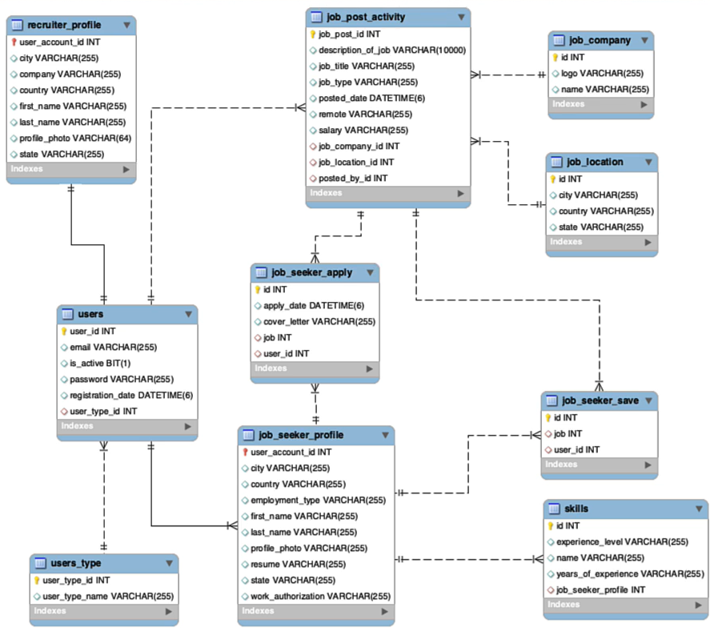

# Job Application Management System

This is a Java Spring MVC project for managing job applications. The project utilizes MySQL for database management, Hibernate for ORM, Thymeleaf for view rendering, and various Spring-based services for business logic.

## Features
- **User Management**: Register, login, and manage user accounts.
- **Job Listings**: Create, read, update, and delete job postings.
- **Application Tracking**: Track job applications, statuses, and interactions.
- **Role-Based Access**: Different functionalities for applicants, recruiters, and admins.
- **Dynamic Views**: Thymeleaf-powered templates for responsive and dynamic user interfaces.

## Technologies Used
- **Java**: Backend logic.
- **Spring MVC**: Framework for building the application.
- **Spring Boot**: Configuration and startup management.
- **MySQL**: Relational database.
- **Hibernate**: ORM for database interactions.
- **Thymeleaf**: Template engine for rendering views.

## Database Design
The database schema is attached in the project files as an image (`database_schema.png`). This diagram provides a comprehensive overview of the relationships and structure of the database tables.



### Key Tables
1. **Users**: Stores user details.
2. **Jobs**: Contains job listing information.
3. **Applications**: Tracks user applications to jobs.
4. **Roles**: Defines user roles such as Applicant, Recruiter, and Admin.

## Project Structure
```
├── src
│   ├── main
│   │   ├── java
│   │   │   └── com.example.jobapplication
│   │   │       ├── controllers
│   │   │       ├── models
│   │   │       ├── repositories
│   │   │       ├── services
│   │   │       └── config
│   │   ├── resources
│   │   │   ├── static
│   │   │   ├── templates
│   │   │   └── application.properties
│   ├── test
│   │   └── java
│   │       └── com.example.jobapplication
│   │           └── JobApplicationTests
└── database_schema.png
```

## Setup and Installation
1. **Clone the Repository**:
   ```bash
   git clone https://github.com/your-username/job-application-system.git
   cd job-application-system
   ```
2. **Configure MySQL Database**:
   Update `application.properties` with your MySQL credentials:
   ```properties
   spring.datasource.url=jdbc:mysql://localhost:3306/job_application_db
   spring.datasource.username=your_username
   spring.datasource.password=your_password
   spring.jpa.hibernate.ddl-auto=update
   ```
3. **Build and Run the Application**:
   ```bash
   mvn clean install
   mvn spring-boot:run
   ```
4. **Access the Application**:
   Navigate to `http://localhost:8080` in your web browser.

## Usage
- **Admin**: Manage users, roles, and overall system settings.
- **Recruiters**: Post and manage job listings.
- **Applicants**: Search for jobs and submit applications.

## Contributing
Contributions are welcome! Please fork the repository and submit a pull request for review.

## License
This project is licensed under the MIT License. See the `LICENSE` file for details.

---

**Contact Information**:
- Email: mironshohmirjonov700.com
- GitHub: [MironshohM](https://github.com/MironshohM/)

Happy Coding!

